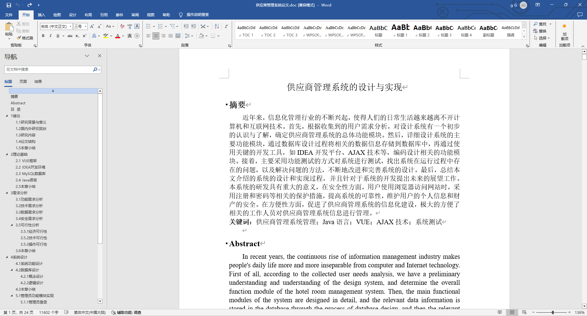
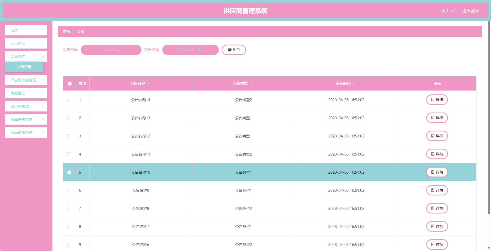
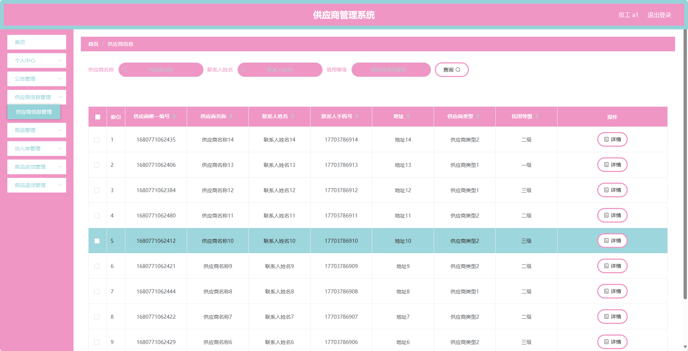
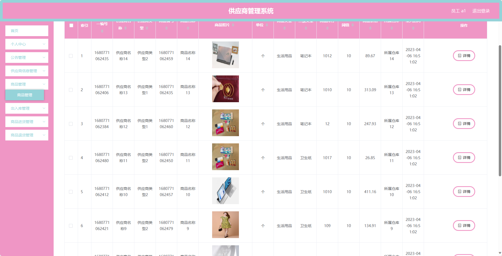
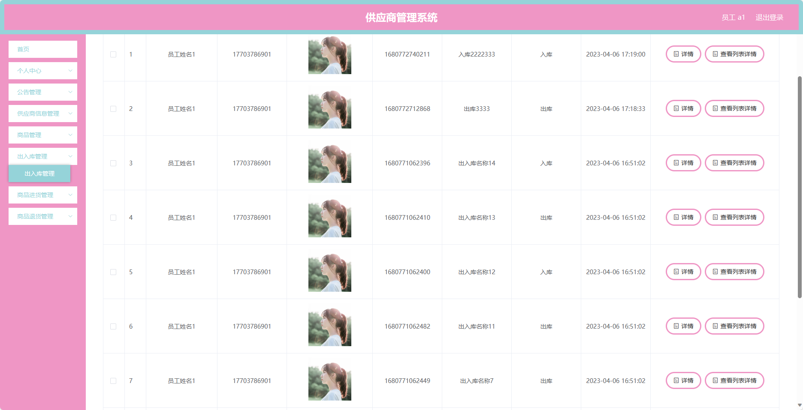
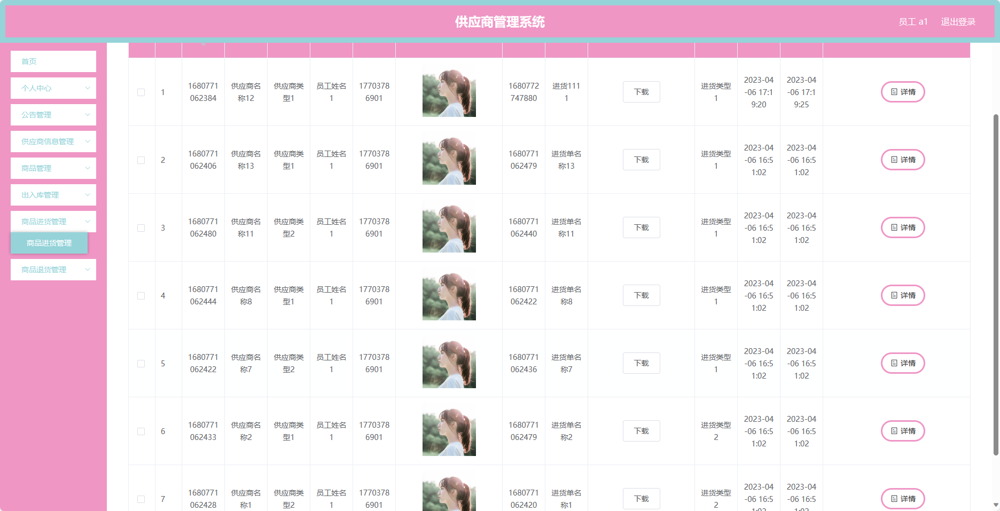
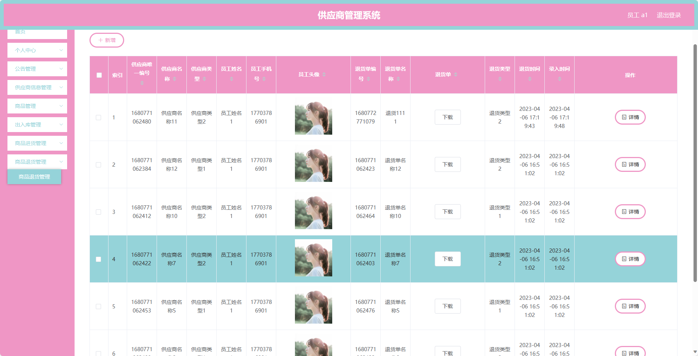
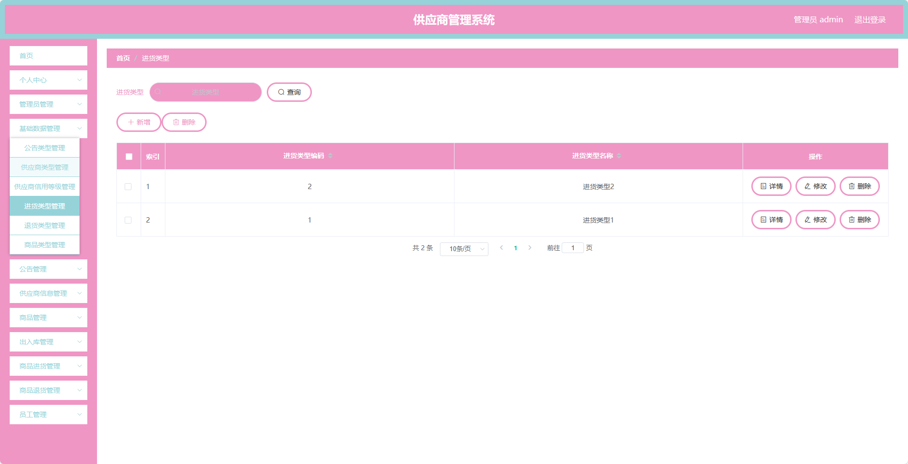
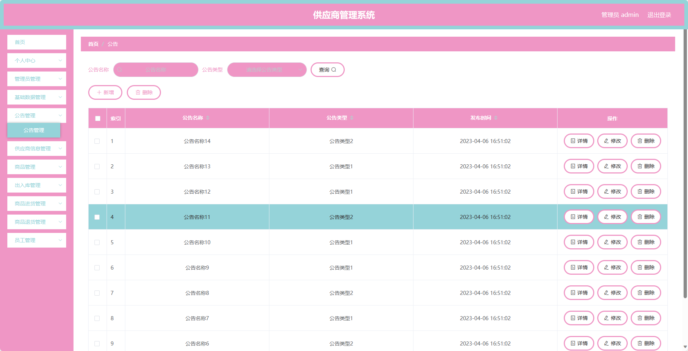

基于Springboot的供应商管理系统（程序+论文）
=
### 完整代码获取地址：从戎源码网 ([https://armycodes.com/](https://armycodes.com/))
### 作者微信：19941326836  QQ：952045282 
### 承接计算机毕业设计、Java毕业设计、Python毕业设计、深度学习、机器学习
### 选题+开题报告+任务书+程序定制+安装调试+论文+答辩ppt 一条龙服务
### 所有选题地址https://github.com/nature924/allProject

一、项目介绍
---
基于Spring Boot框架实现的供应商管理系统，系统包含两种角色：管理员、用户,主要功能如下。

### 前台模块（员工）：
- 个人中心：员工可以管理个人信息，包括修改密码等操作。
- 公告管理：员工可以查看公司发布的公告信息。
- 供应商信息管理：员工可以查看和管理供应商信息，包括添加供应商、编辑供应商、删除供应商等操作。
- 商品管理：员工可以管理商品信息，包括添加商品、编辑商品、删除商品等操作。
- 出入库管理：员工可以记录商品的出入库信息，包括入库记录、出库记录等。
- 商品进货管理：员工可以管理商品的进货信息，包括记录供应商的进货信息、更新库存等操作。
- 商品退货管理：员工可以管理商品的退货信息，包括记录退货原因、更新库存等操作。

### 后台模块（管理员）：
- 个人中心：管理员可以管理个人信息，包括修改密码等操作。
- 管理员管理：管理员可以管理系统中的管理员账号，包括添加管理员、编辑管理员、删除管理员等操作。
- 基础数据管理：管理员可以管理系统的基础数据。
- 公告管理：管理员可以发布和管理公司的公告信息。
- 供应商信息管理：管理员可以查看和管理供应商信息，包括添加供应商、编辑供应商、删除供应商等操作。
- 商品管理：管理员可以管理商品信息，包括添加商品、编辑商品、删除商品等操作。
- 出入库管理：管理员可以查看和管理商品的出入库信息，包括入库记录、出库记录等。
- 商品进货管理：管理员可以管理商品的进货信息，包括记录供应商的进货信息、更新库存等操作。
- 商品退货管理：管理员可以管理商品的退货信息，包括记录退货原因、更新库存等操作。
- 员工管理：管理员可以管理系统的员工账号，包括添加员工、编辑员工、删除员工等操作。

二、项目技术
---
- 编程语言：Java
- 数据库：MySQL
- 项目管理工具：Maven
- 前端技术：VUE、HTML、Jquery、Bootstrap
- 后端技术：Spring、SpringMVC、MyBatis

三、运行环境
---
- 操作系统：Windows、macOS都可以
- JDK版本：JDK1.8以上都可以
- 开发工具：IDEA、Ecplise、Myecplise都可以
- 数据库: MySQL5.7以上都可以
- Tomcat：任意版本都可以
- Maven：任意版本都可以

四、运行截图
---
### 论文截图：

### 程序截图：

